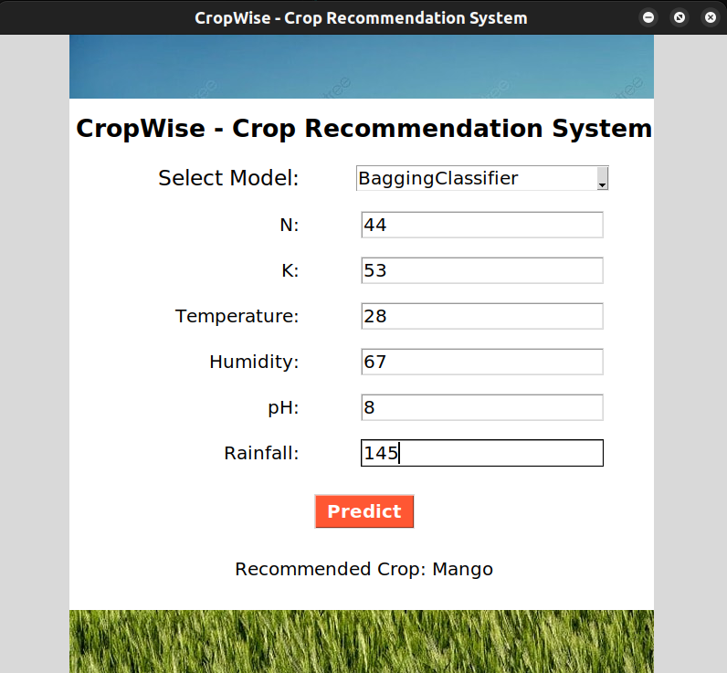

# CropWise

This is a crop prediction ML application build using python. Provided the dataset csv file and the notebook as well.


## Installation

1. Clone the repository:

    ```sh
    git clone https://github.com/itsviv0/CropWise
    cd CropWise
    ```

2. Install the required packages:

    ```sh
    pip install -r requirements.txt
    ```

3. Run the application (Linux, from terminal):
    ```sh
    python3 main.py
    ```

## Usage

1. Run the Jupyter Notebook to preprocess data and train models:

    ```sh
    jupyter notebook CropWise - ML.ipynb
    ```

2. Run the main application:
    ```sh
    python3 main.py
    ```

## Files Structure

-   [Crop_recommendation.csv](http://_vscodecontentref_/3): Dataset used for training and testing the models.
-   `CropWise - ML.ipynb`: Jupyter Notebook for data preprocessing, model training, and evaluation.
-   [main.py](http://_vscodecontentref_/4): Main application script for the crop prediction system.
-   [ML_Models](http://_vscodecontentref_/5): Directory containing trained machine learning models packed into pickle files.
-   [ML_Preprocessors](http://_vscodecontentref_/6): Directory containing preprocessing objects packed into pickle files.
-   [README.md](http://_vscodecontentref_/7): Project documentation.

## Contributing

1. Fork the repository.
2. Create a new branch (`git checkout -b feature-branch`).
3. Commit your changes (`git commit -m 'Add some feature'`).
4. Push to the branch (`git push origin feature-branch`).
5. Open a pull request.

## Install tkinter for mac

```sh
brew install python-tk
```
